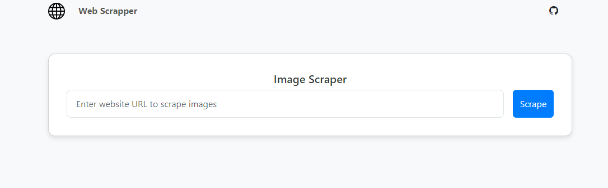

# Web Scrapper



This repository contains a Node.js script that uses Puppeteer and Axios to scrape images from a specified webpage and save them locally. The script fetches all images found in `` tags on the page and stores them in a local directory.

## Features

- **Scrapes Image URLs**: Extracts image URLs from all `` tags on the webpage.
- **Downloads Images**: Fetches and saves the images to a local directory.
- **Handles Directory Creation**: Ensures that the directory for storing images is created if it does not exist.
- **Custom User-Agent**: Uses a browser-like User-Agent to avoid detection and restrictions by the website.

## Requirements

- [Node.js](https://nodejs.org/) (version 14 or higher)
- [npm](https://www.npmjs.com/) (Node Package Manager)

## Installation

1. **Clone the repository:**

    ```bash
    git clone https://github.com/Talha6891/web-scrapper.git
    ```

2. **Navigate to the project directory:**

    ```bash
    cd web-scrapper
    ```

3. **Install the necessary packages:**

    ```bash
    npm install
    ```

## Usage

1. **Open the `index.js` file** and set the `url` variable to the webpage you want to scrape.

2. **Run the script:**

    ```bash
    npm start
    ```

3. The images will be downloaded and saved to the `./images` directory.

## Code Description

- **Imports**: Uses `puppeteer` for browser automation and `axios` for HTTP requests. Also uses `fs` and `path` for file system operations.
- **URL**: Defines the URL of the webpage to scrape.
- **Directory Setup**: Creates the `./images` directory if it does not exist.
- **Puppeteer Setup**: Launches a browser instance, sets a User-Agent, and navigates to the specified URL.
- **Image Extraction**: Collects image URLs from the webpage.
- **Image Download**: Downloads each image and saves it to the `./images` directory.
- **Error Handling**: Logs errors if any image fails to download.

## Notes

- Ensure that the website allows scraping and that you comply with its terms of service.
- The script may need adjustments based on the website’s structure or additional restrictions.

## License

This project is licensed under the [MIT License](LICENSE).

## Contact

For questions or issues, please open an issue on the [GitHub repository](https://github.com/Talha6891/web-scrapper/issues).
